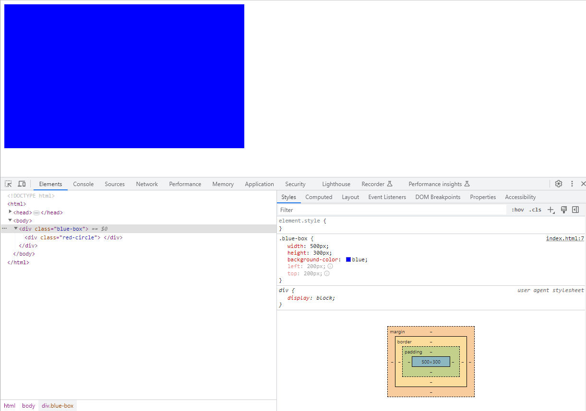
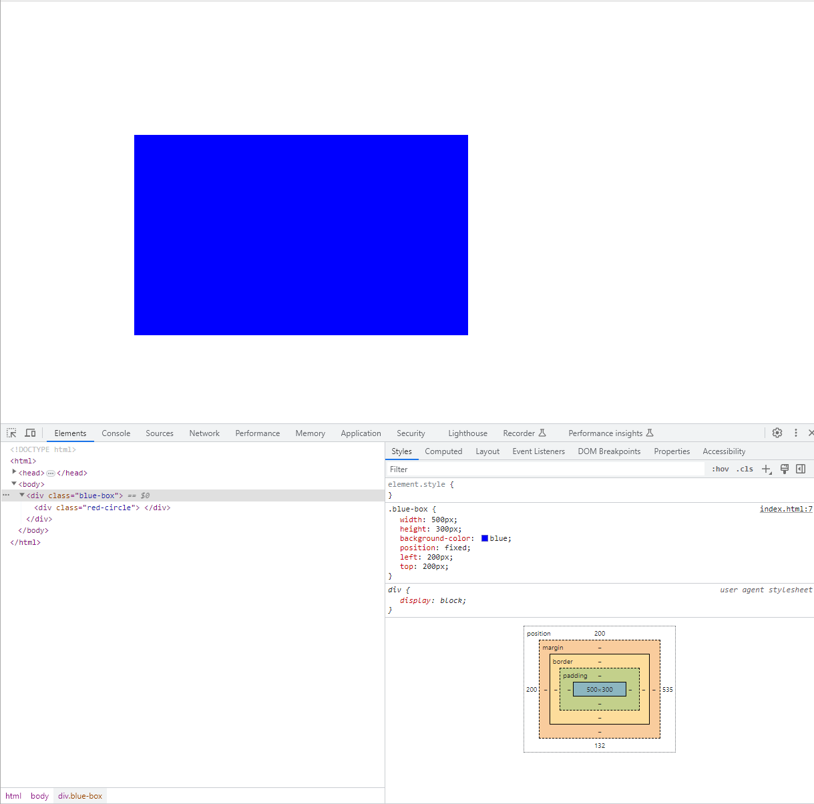
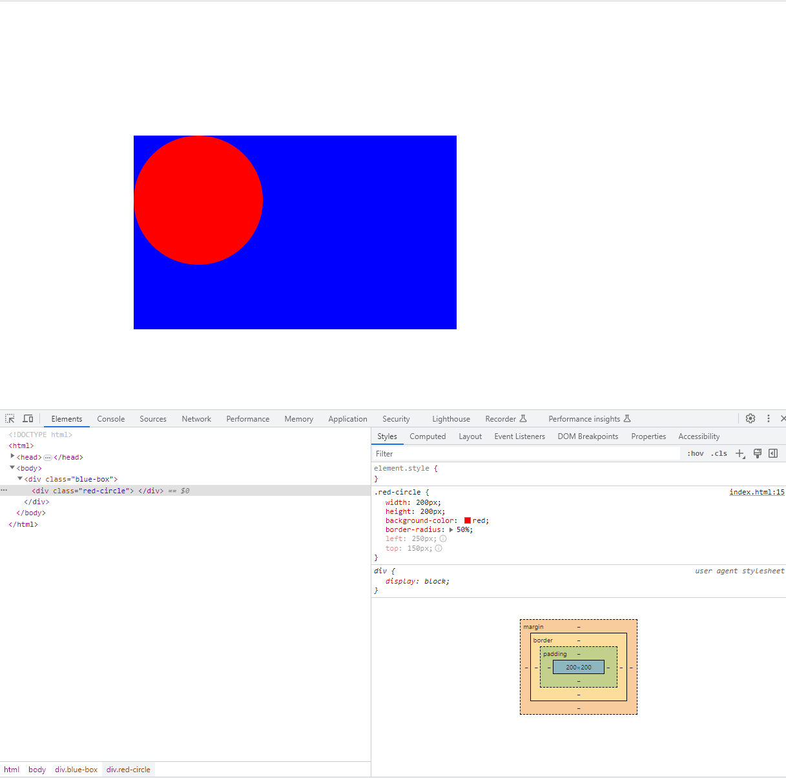
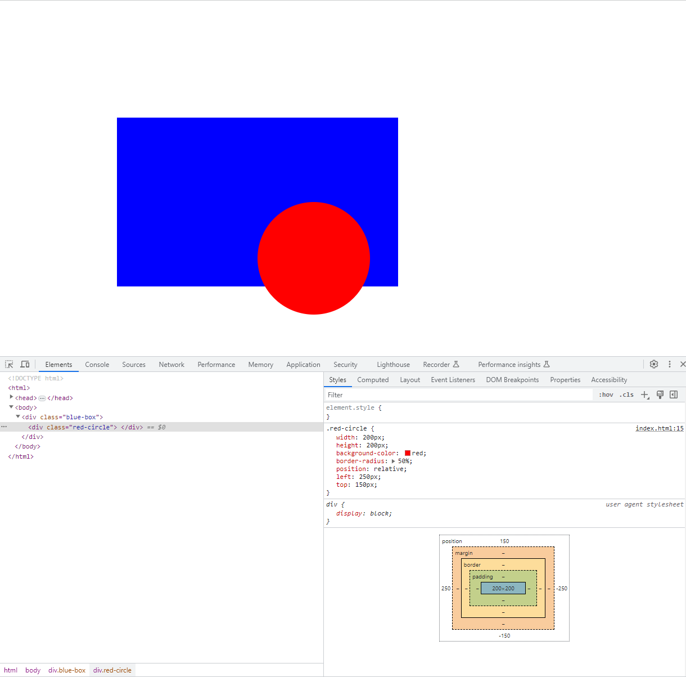
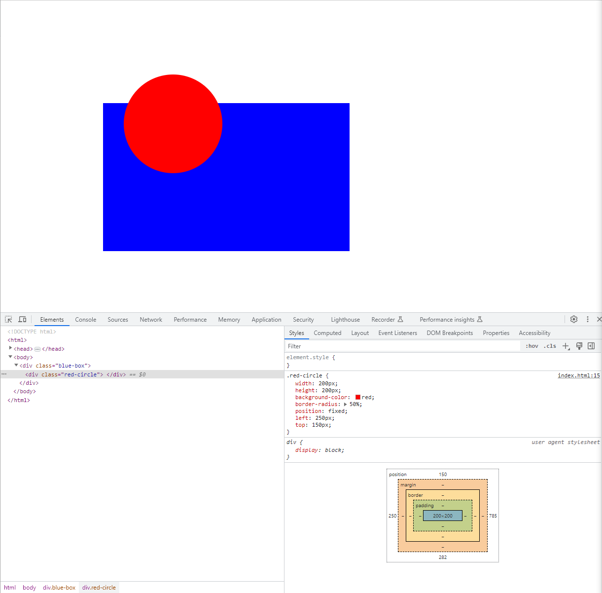

# css_positioning_example
Example to show how positioning works in CSS

Exercise included in Section 7. Intermediate CSS of "The Complete 2023 Web Development Bootcamp" course.

Given the following html file:

```html
<!DOCTYPE html>
<html>

<head>
  <title>CSS Positioning Exercise</title>
  <style>

  </style>
</head>

<body>
  <div class="blue-box">
    <div class="red-circle">
    </div>
  </div>

</body>

</html>
```

and being only allowed to add code inside the <style> tag, the goal is to create a blue rectangle and a red circle and position them as follows:


First of all, I'm going to add the blue rectangle. In the html file there is already a div container tagged as "blue-box" class so we only have to use the right properties. Let's try to provide different values to the *position* property and see the effect on the rendered html. 

**position: static**

This is the default positioning style in html so there is no need to specify the position property. We also provide the rest of the properties to match the color and size desired. So, styling the blue-box div as follows:

```html
  <style>
    .blue-box {
      width: 500px;               /* width of 500 pixels */          
      height: 300px;              /* height of 300 pixels */
      background-color: blue;   /* blue as background color */
      left: 200px;                /* element pushed 200 pixels from the left */
      top: 200px;                 /* element pushed 200 pixels from the top */
    }
  </style>
```

it gets rendered as follows:



With static positioning, the element is placed just at the bottom of whatever previous element. In this case, as blue-box is the first element in the html file it gets positioned at the top left corner of the browser. Note that with static positioning, the properties left and top don't get applied (both appear greyed out in the inspector).

**position: relative**

With relative positioning the position of the element is relative to its default position. So the element is first placed on its default position and then pushed from the top and pushed from the left using the **top** and **left** properties:

```html
  <style>
    .blue-box {
      width: 500px;               /* width of 500 pixels */          
      height: 300px;              /* height of 300 pixels */
      background-color: blue;   /* blue as background color */
      position: relative;         /* Element positioned relatively to its default position */
      left: 200px;                /* element pushed 200 pixels from the left */
      top: 200px;                 /* element pushed 200 pixels from the top */
    }
  </style>
```


**position: absolute**

absolute positioning places the element relative to the nearest ancestor with a position property set or relative to the top left corner of the webpage.

In this case, as blue-box is the first element in the html file, it has no ancestors so it gets positioned relative to the top left corner of the browser having the same effect as using relative positioning:

```html
  <style>
    .blue-box {
      width: 500px;               /* width of 500 pixels */          
      height: 300px;              /* height of 300 pixels */
      background-color: blue;   /* blue as background color */
      position: absolute;         /* absolute positioning */
      left: 200px;                /* element pushed 200 pixels from the left */
      top: 200px;                 /* element pushed 200 pixels from the top */
    }
  </style>
```


**position: fixed**

Finally, we have fixed positioning. What this does is to place the element relative to the top left corner of the window and even if we scroll up and down, the element remains in the same position. If the element is the first one in the html file it behaves as if using absolute positioning except for the scrolling:

```html
  <style>
    .blue-box {
      width: 500px;               /* width of 500 pixels */          
      height: 300px;              /* height of 300 pixels */
      background-color: blue;   /* blue as background color */
      position: fixed;            /* fixed positioning */
      left: 200px;                /* element pushed 200 pixels from the left */
      top: 200px;                 /* element pushed 200 pixels from the top */
    }
  </style>
```



Now that we have reviewed the different values of the position property, we will use the relative positioning for the blue-box div.

Next, we have to create a red circle. This red circle is a div element tagged as "red-circle" class and it is a child of blue-box. This means it is contained inside blue-box so it acts as a boundary regarding the position of red-circle.

Note that in order to create a perfect circle in ccs we just have to add the **border-radious** property and give it a value of 50%.

Now, let's play with the position property. If we were to use the dafult positioning (static) and given that the circle is the firts (and only) element inside blue-box, it would position in the top left corner of blue-box:

```html
  <style>
    .blue-box {
      width: 500px;               /* width of 500 pixels */          
      height: 300px;              /* height of 300 pixels */
      background-color: blue;   /* blue as background color */
      position: relative;         /* Element positioned relatively to its default position */
      left: 200px;                /* element pushed 200 pixels from the left */
      top: 200px;                 /* element pushed 200 pixels from the top */
    }
  .red-circle {
      width: 200px;               /* width of 200 pixels */
      height: 200px;              /* height of 200 pixels */
      background-color: red;    /* red as background color */
      border-radius: 50%;         /* 50% radious makes a perfect circle */
      left: 250px;                /* element pushed 250 pixels from the left */
      top: 150px;                 /* element pushed 150 pixels from the top */
    }
</style>
```



Again, the top and left properties have no effect.

Using **relative** positioning, the circle will move 50 pixels from the left and 150 pixels from the top of its default position so it matches the desired final position.

```html
  <style>
    .blue-box {
      width: 500px;               /* width of 500 pixels */          
      height: 300px;              /* height of 300 pixels */
      background-color: blue;   /* blue as background color */
      position: relative;         /* Element positioned relatively to its default position */
      left: 200px;                /* element pushed 200 pixels from the left */
      top: 200px;                 /* element pushed 200 pixels from the top */
    }
  .red-circle {
      width: 200px;               /* width of 200 pixels */
      height: 200px;              /* height of 200 pixels */
      background-color: red;    /* red as background color */
      border-radius: 50%;         /* 50% radious makes a perfect circle */
      position: relative;         /* Position relative to its default position */
      left: 250px;                /* element pushed 250 pixels from the left */
      top: 150px;                 /* element pushed 150 pixels from the top */
    }
  </style>
```



Using **absolute** positioning has the same effect. As we said before, absolute positioning places the element relative to the nearest ancestor with the position property set or relative to the top left corner of the browser. As blue-box has the position property set to relative, red-circle is moved 250 pixels and 150 pixels from the top left corner of blue-box:

```html
  <style>
    .blue-box {
      width: 500px;               /* width of 500 pixels */          
      height: 300px;              /* height of 300 pixels */
      background-color: blue;   /* blue as background color */
      position: relative;         /* Element positioned relatively to its default position */
      left: 200px;                /* element pushed 200 pixels from the left */
      top: 200px;                 /* element pushed 200 pixels from the top */
    }
    .red-circle {
      width: 200px;               /* width of 200 pixels */
      height: 200px;              /* height of 200 pixels */
      background-color: red;    /* red as background color */
      border-radius: 50%;         /* 50% radious makes a perfect circle */
      position: absolute;         /* Position relative to blue-box */
      left: 250px;                /* element pushed 250 pixels from the left */
      top: 150px;                 /* element pushed 150 pixels from the top */
    }
</style>
```


Finally, if we were to use **fixed** as positioning, the red circle would be positioned fixed relative to the top left corner of the screen, 250 pixels to the right and 150 pixels to the bottom: 

```html
  <style>
    .blue-box {
      width: 500px;               /* width of 500 pixels */          
      height: 300px;              /* height of 300 pixels */
      background-color: blue;   /* blue as background color */
      position: relative;         /* Element positioned relatively to its default position */
      left: 200px;                /* element pushed 200 pixels from the left */
      top: 200px;                 /* element pushed 200 pixels from the top */
    }
  .red-circle {
      width: 200px;               /* width of 200 pixels */
      height: 200px;              /* height of 200 pixels */
      background-color: red;    /* red as background color */
      border-radius: 50%;         /* 50% radious makes a perfect circle */
      position: fixed;            /* Position fixed relative to the top left corner of the screen */
      left: 250px;                /* element pushed 250 pixels from the left */
      top: 150px;                 /* element pushed 150 pixels from the top */
    }
</style>
```



So, regarding red-circle element, we will stick with relative positioning although we could use absolute as well.

## What have we learnt in this exercise?

- The different values of the **position** property and how they behave.
- How to create a perfect circle using ccs styling.
- The **left** and **top** properties.


