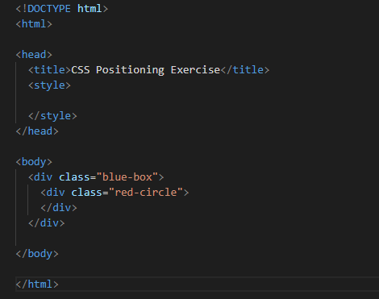

# css_positioning_example
Example to show how positioning works in CSS

Exercise included in Section 7. Intermediate CSS of "The Complete 2023 Web Development Bootcamp" course.

The idea here is to use internal css styling to create a blue rectangle and a red circle and position them as follows:

Given the following html file:

We can add code inside the <style> tag.

